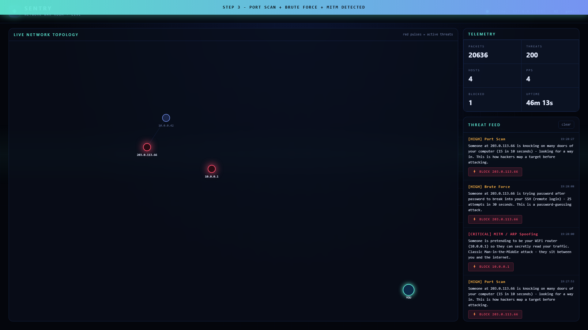
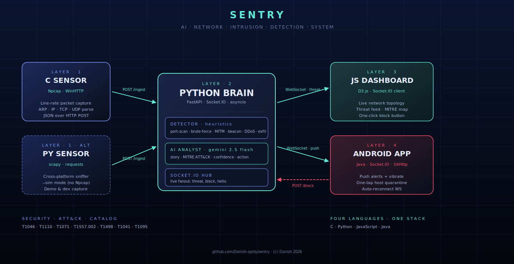
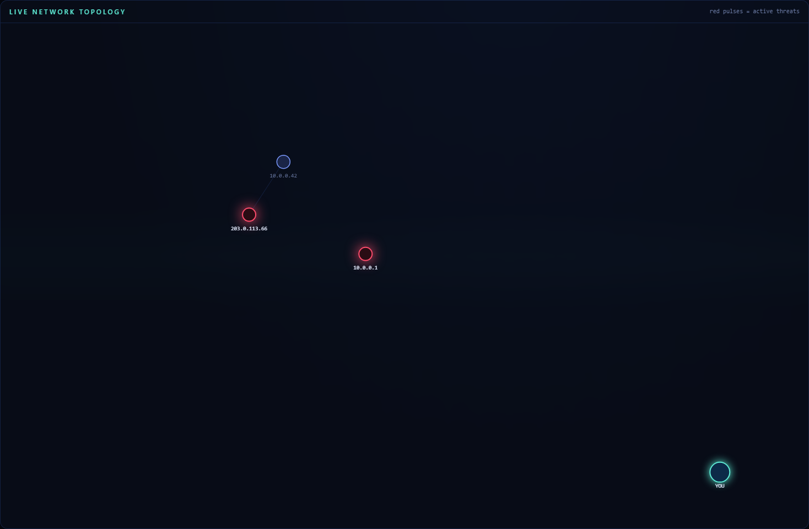
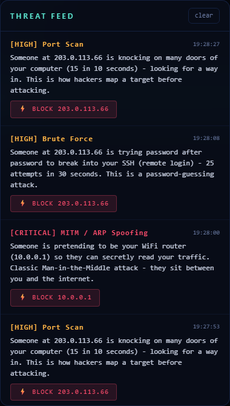

# SENTRY

### AI-powered Network Intrusion Detection System
### Polyglot by design — **C · Python · JavaScript · Java**

-orange?style=flat-square)

**Real-time detection of 7 attack classes — mapped to MITRE ATT&CK — with live AI analyst.**

---

> ## 🔒 Source code is private
>
> This is the public **showcase** of SENTRY. The full source code lives in a private repo.
> **Recruiters / hiring managers:** request read-only access by reaching out to me directly — I will grant temporary GitHub collaborator access for the duration of our conversation.

---

## What is SENTRY

SENTRY is a **mini Darktrace** built in one weekend.

A high-speed packet sensor watches every connection on the network. A Python brain inspects each packet through both **deterministic heuristics** (port scans, brute force, beaconing, MITM, exfil, floods, known-bad IPs) and an **LLM analyst** (Gemini) that writes a human story and maps the event to its MITRE ATT&CK technique. The result is streamed live to a D3.js war-room dashboard and pushed to an Android app where the operator can quarantine an attacker host with one tap.

> SENTRY isn't a science project. Every layer is wired to every other layer end-to-end. **The CCTV camera, the security guard, the screen wall, the walkie-talkie — all built from scratch, all talking.**

## Demo — guided 30-second walkthrough (Full HD 1080p)

Click the play button below — embedded HD video, plays inline:

https://github.com/Danish-spidy/sentry-showcase/raw/main/docs/demo.mp4

<video src="https://github.com/Danish-spidy/sentry-showcase/raw/main/docs/demo.mp4" controls width="100%"></video>

Captions in the video show each step:

1. **STEP 1** — SENTRY brain online, dashboard live
2. **STEP 2** — Sensor begins ingesting packets
3. **STEP 3** — Port scan + brute force + MITM detected
4. **STEP 4** — Gemini AI writes story + MITRE ATT&CK map
5. **STEP 5** — One-click BLOCK quarantines the attacker

> If the video does not auto-embed in your browser, [click here to watch in HD](docs/demo.mp4) (3.3 MB Full HD MP4).

## Architecture

## Why four languages

| Layer | Language | Why **this** one |
|-------|----------|------------------|
| Packet sensor | **C** | Line-rate capture; Python's GIL chokes on real traffic |
| Brain & AI | **Python** | Best ML / Gemini SDK / FastAPI ecosystem |
| War-room dashboard | **JavaScript** | Browsers run JS; D3 is unmatched for live topology |
| Phone alert app | **Java** | Native Android; instant notifications + system-level block |

Every language earns its place. **Nothing forced.**

## Detection coverage

Each threat is enriched by Gemini with a one-sentence story, an attacker confidence rating, and a recommended action (`MONITOR` · `ALERT` · `BLOCK_HOST` · `ISOLATE_NETWORK`).

| Attack | Heuristic signal | Severity | MITRE ATT&CK |
|--------|------------------|----------|--------------|
| Port Scan | N+ distinct ports / 10s from one src | HIGH | `T1046` Network Service Scanning |
| Brute Force | 25+ SYNs to auth port / 30s | HIGH | `T1110` Brute Force |
| RAT / C2 Beaconing | Regular interval contact (jitter < 20%) | HIGH | `T1071` Application Layer Protocol |
| MITM / ARP Spoof | MAC change for known IP | CRITICAL | `T1557.002` ARP Cache Poisoning |
| DDoS / Flood | PPS spike above baseline | HIGH | `T1498` Network DoS |
| Data Exfiltration | Outbound bytes / window | MEDIUM | `T1041` Exfiltration Over C2 |
| Known Malicious IP | Static CIDR list (extensible) | CRITICAL | `T1071` C2 Infrastructure |

## Components (full source available on request)

| Component | Stack | What it does |
|-----------|-------|--------------|
| Brain | FastAPI · Socket.IO · Gemini · scapy | Detector, AI analyst, live WebSocket stream, block API |
| Python sensor | scapy · requests | Live sniffer + `--sim` demo mode (no Npcap needed) |
| C sensor | C · Npcap · WinHTTP | High-speed packet capture for line-rate networks |
| Dashboard | D3.js · Socket.IO client | War-room topology + threat feed |
| Mobile alert | Java · Socket.IO · OkHttp | Phone alerts + one-tap host quarantine |

More screenshots

| Topology | Threat feed |
|----------|-------------|
|  |  |

## Roadmap

- [ ] sklearn `IsolationForest` for unsupervised zero-day anomaly detection
- [ ] Persistent threat history (SQLite)
- [ ] Multi-sensor fanout (one brain, N sensors)
- [ ] iOS port of the alert app (Flutter)
- [ ] Auto-block via Windows firewall API instead of soft-block

## Contact

For source-code access or to discuss SENTRY, reach out via my GitHub profile.

## Licence

(c) 2026 Danish · All rights reserved. Proprietary.
